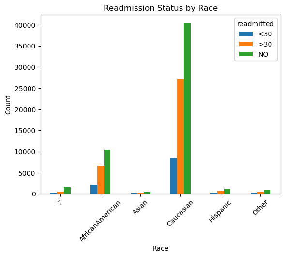

# Predicting Hospital Readmission for Diabetes Patients

## Introduction
Effective management of chronic diseases is a critical challenge in healthcare systems worldwide. Diabetes, in particular, imposes a significant burden on individuals and healthcare providers due to its high prevalence and associated complications. Hospital readmission rates for diabetes patients, especially within a short time frame, reflect suboptimal care coordination, disease management, and patient outcomes.

Accurately predicting hospital readmissions for diabetes patients can play a vital role in improving patient care, optimizing healthcare resource allocation, and reducing costs. Identifying individuals at higher risk of readmission allows healthcare providers to implement targeted interventions, timely follow-up care, and personalized treatment plans to minimize readmission risks and enhance patient outcomes.

In this project, we aim to develop a predictive model using machine learning techniques to forecast hospital readmission for diabetes patients. Analyzing a comprehensive dataset of patient demographics, clinical variables, medications, and encounter information, we explore factors contributing to readmission risk and build a robust predictive model. The project encompasses data preprocessing, feature engineering, model selection, and evaluation to create a reliable tool for healthcare professionals to identify patients who may benefit from targeted interventions and proactive care management.

The insights gained from this project can inform healthcare providers, policymakers, and researchers about the factors influencing hospital readmissions for diabetes patients. Leveraging data-driven approaches enhances care quality, optimizes resource utilization, and ultimately improves patient outcomes in diabetes management.

## Scoping
### Project Goals

Develop a machine learning model predicting hospital readmission likelihood for diabetes patients. Assist healthcare providers in identifying high-risk patients, implementing proactive measures, preventing readmissions, and optimizing resource allocation.

### Data Source

The dataset originates from the UCI Machine Learning Repository, titled "Diabetes 130-US hospitals for years 1999-2008" by Clore, Krzysztof Cios, Jon DeShazo, and Beata Strack.

#### Data Characteristics

The dataset represents 10 years (1999-2008) of clinical care at 130 US hospitals and integrated delivery networks. It includes over 50 features representing patient and hospital outcomes. Information was extracted from the database for encounters that satisfied the following criteria.

1.	It is an inpatient encounter (a hospital admission).
2.	It is a diabetic encounter, that is, one during which any kind of diabetes was entered to the system as a diagnosis.
3.	The length of stay was at least 1 day and at most 14 days.
4.	Laboratory tests were performed during the encounter.
5.	Medications were administered during the encounter.

The data contains such attributes as patient number, race, gender, age, admission type, time in hospital, medical specialty of admitting physician, number of lab test performed, HbA1c test result, diagnosis, number of medication, diabetic medications, number of outpatient, inpatient, and emergency visits in the year before the hospitalization, etc.

### Analysis

Utilize descriptive statistics and data visualization to understand variable distribution, counts, and relationships. Select relevant features for the prediction model via statistical tests, correlation analysis, or domain knowledge. Employ machine learning algorithms like logistic regression, random forest, or gradient boosting to develop a predictive model for hospital readmission.

### Evaluation

Assess the model's performance using metrics like accuracy, precision, recall, and area under the ROC curve. Evaluate the model's ability to predict hospital readmissions accurately and its generalizability.